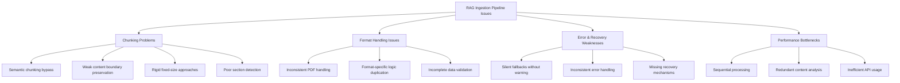
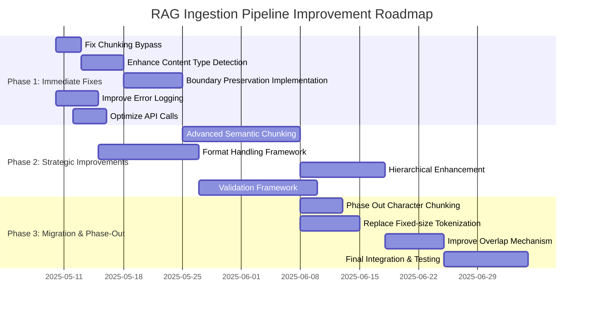

# RAG Ingestion Pipeline Improvement Plan

## Executive Summary

This document outlines a comprehensive plan for improving the RAG system's ingestion pipeline, focusing primarily on addressing chunking strategies that lead to context fragmentation and quality issues. The plan includes prioritized recommendations, an implementation roadmap, technical details, and success metrics.

## Table of Contents

- [Analysis Summary](#analysis-summary)
- [Prioritized Recommendations](#prioritized-recommendations)
  - [Immediate Fixes](#immediate-fixes)
  - [Strategic Improvements](#strategic-improvements)
  - [Techniques to Phase Out](#techniques-to-phase-out)
- [Implementation Roadmap](#implementation-roadmap)
- [Detailed Technical Recommendations](#detailed-technical-recommendations)
- [Success Metrics](#success-metrics)

## Analysis Summary

After reviewing the RAG system codebase, particularly `ingest_rag.py`, `adaptive_chunking.py`, `rich_metadata.py`, `hierarchical_embeddings.py`, `entity_extraction.py`, `deduplication.py`, and test files, several issues have been identified:

**Chunking Problems:**
- Semantic chunking bypass at `ingest_rag.py:254` that defaults to simpler methods
- Weak content boundary preservation that breaks semantic units
- Rigid fixed-size chunking approaches that ignore content structure
- Poor section detection that misses natural document boundaries

**Format Handling Issues:**
- Inconsistent PDF and other document format handling
- Format-specific logic duplication across the codebase
- Incomplete data validation for different document types

**Error Recovery Weaknesses:**
- Silent fallbacks to basic methods without detailed logs
- Inconsistent error handling across components
- Missing recovery mechanisms for partial failures

**Performance Bottlenecks:**
- Sequential processing where parallelism is possible
- Redundant content analysis steps
- Inefficient API usage patterns



## Prioritized Recommendations

Recommendations are categorized into "Immediate Fixes" (high impact, low effort) and "Strategic Improvements" (higher effort, long-term value).

### Immediate Fixes

1. **Fix Semantic Chunking Bypass** (Critical Priority)
   - **Issue**: Code at `ingest_rag.py:254` has a logic issue that bypasses the adaptive chunking system
   - **Fix**: Remove bypass and enforce proper semantic chunking by modifying the condition logic
   - **Impact**: Immediate improvement in chunk semantic coherence
   - **Dependencies**: None - this is a foundational fix

2. **Enhance Content Type Detection** (High Priority)
   - **Issue**: Current content-type detection in `adaptive_chunking.py` is too simplistic
   - **Fix**: Improve pattern matching and content classification logic
   - **Impact**: Better chunking strategy selection based on content type
   - **Dependencies**: Requires fix for semantic chunking bypass first

3. **Implement Boundary Preservation** (High Priority)
   - **Issue**: Current chunking breaks important structural boundaries like tables, code blocks
   - **Fix**: Enhance `chunk_code`, `chunk_table`, and related functions to preserve logical boundaries
   - **Impact**: Reduced fragmentation of semantically coherent units
   - **Dependencies**: Improved content type detection

4. **Improve Error Logging & Recovery** (Medium-High Priority)
   - **Issue**: Pipeline silently falls back to basic methods without detailed logs
   - **Fix**: Add structured logging and fallback selection logic
   - **Impact**: Better debugging and monitoring of problematic content
   - **Dependencies**: None - can be implemented in parallel

5. **Optimize Embedding API Calls** (Medium Priority)
   - **Issue**: Current implementation is inefficient with API calls
   - **Fix**: Batch properly, retry with backoff, better error handling
   - **Impact**: Cost reduction, improved throughput
   - **Dependencies**: None - can be implemented in parallel

### Strategic Improvements

1. **Advanced Semantic Chunking Implementation** (2-3 weeks)
   - **Description**: Replace current basic approaches with more advanced semantic understanding
   - **Components**:
     - Enhanced content-type classification with ML support
     - Document structure analysis before chunking
     - Semantic boundary detection based on topic shifts
   - **Impact**: Much higher quality chunks with true semantic coherence
   - **Dependencies**: Requires immediate fixes first

2. **Unified Format Handling Framework** (3-4 weeks)
   - **Description**: Consolidate format-specific handling into a pluggable framework
   - **Components**:
     - Format-specific adapter interfaces
     - Configuration-driven processing pipeline
     - Consistent error handling across formats
   - **Impact**: Easier addition of new formats, more consistent quality
   - **Dependencies**: Improved error logging and recovery

3. **Hierarchical Chunking Enhancement** (4-5 weeks)
   - **Description**: Improve hierarchical structure with explicit parent-child relationships
   - **Components**:
     - Better document structure detection
     - Explicit tree-based chunk relationships
     - Improved metadata inheritance
   - **Impact**: Better context preservation during retrieval
   - **Dependencies**: Advanced semantic chunking implementation

4. **Validation & Quality Monitoring Framework** (6-8 weeks)
   - **Description**: Implement automated evaluation of chunk quality
   - **Components**:
     - Chunk quality metrics (coherence, completeness)
     - Sampling-based validation
     - Feedback loop for continuous improvement
   - **Impact**: Systematic quality improvement
   - **Dependencies**: All other strategic improvements

### Techniques to Phase Out

1. **Character-based Chunking Methods**
   - **Issue**: Basic character-based chunking destroys semantic meaning
   - **Replacement**: Content-aware semantic chunking
   - **Timeline**: Phase out after advanced semantic chunking implementation

2. **Fixed-size Tokenization**
   - **Issue**: Fixed token count chunking ignores content structure
   - **Replacement**: Adaptive-size chunks based on content type
   - **Timeline**: Phase out gradually as content-type detection improves

3. **Simple Overlap Without Context**
   - **Issue**: Current overlap implementation duplicates content without context
   - **Replacement**: Contextual reference approach with hierarchical links
   - **Timeline**: Phase out after hierarchical chunking enhancement

## Implementation Roadmap

The implementation roadmap is divided into three phases:



### Phase 1: Immediate Fixes (1-2 weeks)
- Focus on the critical chunking bypass fix first
- Implement enhanced content type detection
- Add boundary preservation improvements
- Improve error logging in parallel
- Optimize API usage patterns

### Phase 2: Strategic Improvements (2-8 weeks)
- Develop advanced semantic chunking first
- Create unified format handling framework
- Enhance hierarchical relationships
- Build validation framework

### Phase 3: Migration & Phase-Out (2-3 weeks)
- Gradually phase out character-based chunking
- Replace fixed-size tokenization
- Implement contextual overlap mechanisms
- Final integration and comprehensive testing

## Detailed Technical Recommendations

### 4.1 Fixing the Chunking Bypass Issue

The most critical issue identified is in `ingest_rag.py` around line 254, where the semantic chunking is being bypassed:

```python
# Current problematic code - adaptive chunking is checked but often bypassed
if use_adaptive_chunking:
    try:
        import time
        start_time = time.time()

        # Import adaptive chunking module
        try:
            from adaptive_chunking import adaptive_chunk_text
            click.echo(f"[info] Using content-aware adaptive chunking")

            chunks = adaptive_chunk_text(text, max_chars=max_chars)

            # Verify we got valid chunks
            if chunks and all(isinstance(c, str) for c in chunks):
                elapsed_time = time.time() - start_time
                click.echo(f"[info] Adaptive chunking produced {len(chunks)} chunks in {elapsed_time:.2f} seconds")
                return chunks
            else:
                click.echo("[warning] Adaptive chunking failed to produce valid chunks, trying semantic chunking", err=True)
        except ImportError as ie:
            click.echo(f"[warning] Adaptive chunking not available: {ie}", err=True)
            click.echo("[info] Falling back to semantic chunking", err=True)
        except Exception as e:
            click.echo(f"[warning] Adaptive chunking failed: {e}", err=True)
            click.echo("[info] Falling back to semantic chunking", err=True)
    except Exception as e:
        click.echo(f"[warning] Unexpected error in adaptive chunking: {e}", err=True)
```

**Recommended Fix**:
- Restructure the adaptive chunking logic to ensure proper execution
- Add detailed error logging for each failure case
- Implement structured fallback selection based on exception type
- Ensure clear control flow for each processing path

### 4.2 Enhancing Content-Type Detection

The current content type detection in `adaptive_chunking.py` needs improvement:

```python
def detect_content_type(text: str) -> Dict[str, float]:
    """
    Detect document content types with confidence scores.
    """
    # Current implementation has limited patterns and confidence calculation
```

**Recommended Enhancements**:
- Add more sophisticated pattern recognition for content types
- Implement statistical analysis of content characteristics
- Consider ML-based classification for complex content
- Improve confidence scoring with weighted features
- Handle mixed-type content more effectively

### 4.3 Boundary Preservation Implementation

The current chunking often breaks important boundaries in code, tables, and other structured content:

```python
def chunk_code(text: str, max_chars: int) -> List[str]:
    """
    Specialized chunking for code that preserves function/class boundaries.
    """
    # Current implementation has limited language detection and boundary recognition
```

**Recommended Enhancements**:
- Improve language detection for more programming languages
- Enhance boundary detection with better regex patterns
- Implement structure-aware splitting for nested content
- Preserve complete semantic units wherever possible
- Add context metadata for split boundaries

### 4.4 Hierarchical Structure Enhancement

The current hierarchical approach needs better parent-child relationships:

```python
def group_chunks_into_sections(chunks: List[Document]) -> List[Dict[str, Any]]:
    """
    Group individual chunks into logical sections based on content and metadata.
    """
    # Current implementation has simplistic grouping based on basic patterns
```

**Recommended Enhancements**:
- Implement more sophisticated document structure analysis
- Create explicit hierarchical relationships with bidirectional links
- Improve section detection with better semantic understanding
- Enhance metadata inheritance across hierarchy levels
- Support cross-references between related chunks

## Success Metrics

To measure the success of these improvements, we recommend tracking these key metrics:

1. **Semantic Coherence**: 
   - Measure chunk semantic coherence using embedding similarity
   - Compare semantic relatedness of adjacent chunks
   - Track reduction in mid-concept splits

2. **Retrieval Precision**: 
   - Track improvements in RAG retrieval precision
   - Measure relevance of retrieved chunks to queries
   - Evaluate context completeness in retrievals

3. **Hallucination Rate**: 
   - Monitor reduction in hallucinations/incorrect facts
   - Conduct factual accuracy evaluations
   - Compare to baseline hallucination measurements

4. **Processing Performance**: 
   - Track ingestion pipeline throughput
   - Measure processing time by document type
   - Monitor API call efficiency and costs

5. **Error Rates**: 
   - Track reduction in processing errors and fallbacks
   - Monitor error recovery success rate
   - Measure ingestion completion rate by format type

Each metric should be measured pre-implementation to establish baselines, then tracked throughout the implementation phases to demonstrate progress and value.