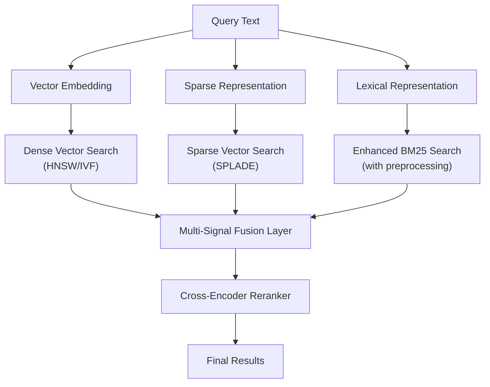
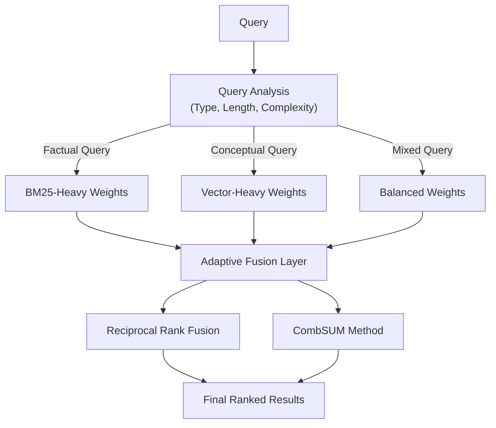
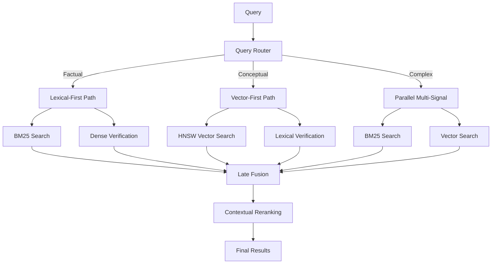
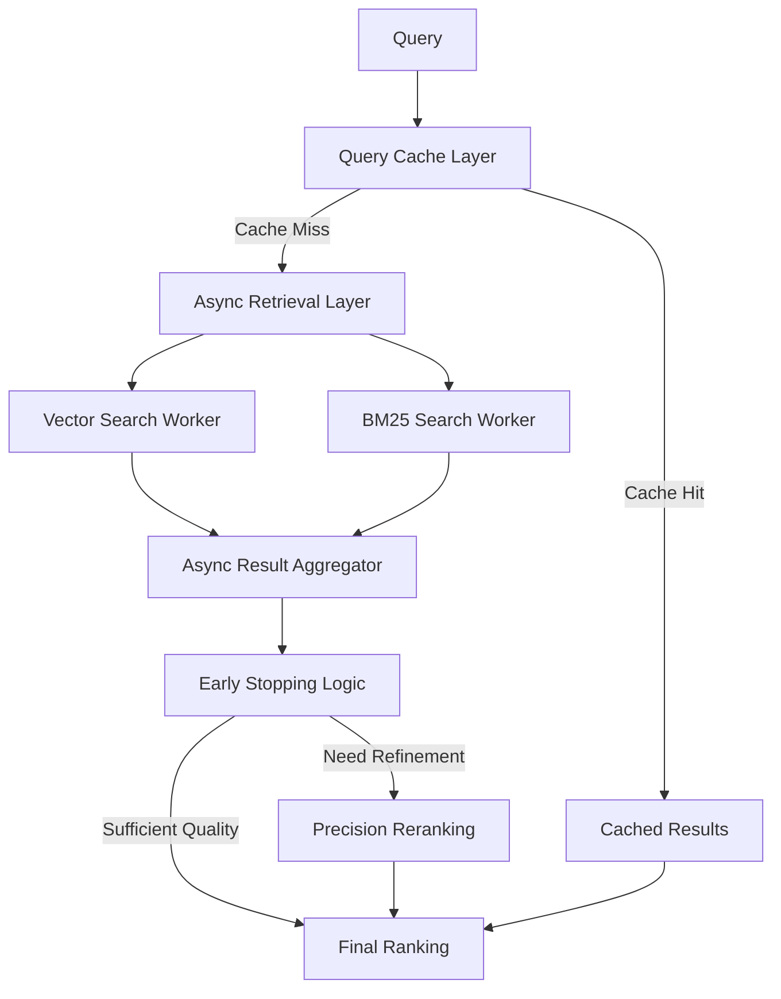
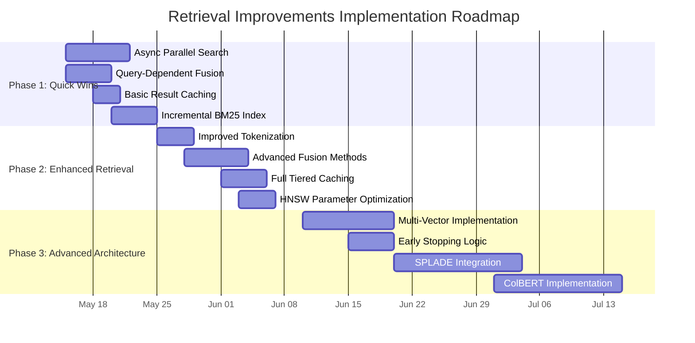

# RAG Retrieval Methods Improvement Plan

## Executive Summary

This document outlines a comprehensive plan for improving retrieval methods in the current RAG implementation. Based on an analysis of `query_rag.py`, we've identified several limitations in the current implementation:

1. **Hybrid Search Architecture**:
   - Sequential vector-first approach followed by BM25 reranking
   - Static fusion parameters (alpha=0.5) regardless of query type
   - Basic tokenization using simple split() for BM25
   - Inefficient corpus-wide BM25 index building and loading

2. **Performance Bottlenecks**:
   - Sequential processing that could be parallelized
   - No caching mechanisms for frequently used queries or embeddings
   - Rebuilding the entire BM25 index rather than incremental updates

The plan provides both theoretical architecture improvements and concrete implementation suggestions across four key areas, organized into a phased implementation roadmap.

## Current System Analysis

After examining the codebase, particularly `query_rag.py`, we've identified the following specific limitations:

```python
# Current BM25 tokenization is overly simplistic (line 587):
tokenized = [id2text[_id].split() for _id in ids]

# Static fusion regardless of query type (lines 614-621):
fused_scores: dict[str, float] = {}
for pid in set(vec_rank) | set(bm25_rank):
    score_h = 0.0
    if pid in vec_rank:
        score_h += alpha * (1.0 / (rrf_k + vec_rank[pid]))  # alpha is static 0.5
    if pid in bm25_rank:
        score_h += (1.0 - alpha) * (1.0 / (rrf_k + bm25_rank[pid]))
    fused_scores[pid] = score_h

# Inefficient BM25 index building (lines 534-579):
# Full collection scan on every query if index doesn't exist
```

## 1. Advanced Similarity Metrics and Hybrid Search Approaches



### Theoretical Recommendations

#### 1.1 ColBERT/Late-Interaction Models

Late-interaction models like ColBERT represent both queries and documents as sets of contextual embeddings rather than single vectors. This enables token-level interactions that capture more nuanced relationships.

**Benefits:**
- More precise matching at token level
- Better handling of rare terms and out-of-distribution queries
- Addresses limitations of single vector representations

**Implementation Considerations:**
- Requires storing multiple vectors per document
- Higher storage requirements than single-vector approaches
- Can be implemented with compressed representations for efficiency

#### 1.2 SPLADE (Sparse Lexical And Dense Expansion)

SPLADE is a learned sparse retrieval model that bridges the gap between traditional lexical methods (like BM25) and semantic search.

**Benefits:**
- Preserves efficiency of sparse retrieval
- Expands both documents and queries with semantically related terms
- Trained end-to-end for optimal term weighting

**Implementation Considerations:**
- Requires a pre-trained SPLADE model
- Can leverage existing inverted index infrastructure
- Compatible with hybrid retrieval approaches

#### 1.3 Multi-Vector Representation

Rather than representing each document with a single vector, multi-vector approaches store multiple embeddings for different segments (paragraphs, sentences) of each document.

**Benefits:**
- Better representation of document substructures/topics
- More granular matching with query intents
- Higher recall for longer documents

**Implementation Considerations:**
- Increases storage requirements
- Requires efficient nearest-neighbor search across multiple vectors
- Can be combined with contextualized embeddings

### Implementation Suggestions

#### Improved Tokenization for BM25

```python
def improved_tokenization(text):
    """Better tokenization for BM25 compared to simple split()"""
    # Clean text - remove special chars, normalize whitespace
    text = re.sub(r'[^\w\s]', ' ', text)
    text = re.sub(r'\s+', ' ', text).strip().lower()
    
    # Use more robust word tokenization
    tokens = text.split()
    
    # Remove stopwords (can be expanded)
    stopwords = {'and', 'the', 'is', 'in', 'to', 'of', 'a'}
    tokens = [t for t in tokens if t not in stopwords]
    
    # Optional: Apply stemming or lemmatization
    return tokens

# Replace line ~587 with this improved tokenization
tokenized = [improved_tokenization(id2text[_id]) for _id in ids]
```

#### Multi-Vector Implementation

```python
def extract_sentences(text):
    """Extract sentences from text to create multiple vectors"""
    # Basic sentence splitting - can be improved with better NLP
    sentences = re.split(r'(?<=[.!?])\s+', text)
    return [s.strip() for s in sentences if s.strip()]

# During document indexing, store sentence vectors
# This would be added to ingest_rag.py, but affects query_rag.py retrieval
```

## 2. Efficient Fusion Methods for Combining Multiple Retrieval Signals



### Theoretical Recommendations

#### 2.1 Query-Dependent Fusion Weights

Rather than using a fixed alpha parameter (0.5) for all queries, this approach analyzes query characteristics to determine optimal weight distribution between dense and sparse retrievers.

**Benefits:**
- Better handling of different query types
- Adapts to factual vs. conceptual queries
- Can be refined based on user feedback

**Implementation Considerations:**
- Can start with rule-based approach and evolve to learned approach
- Requires query analysis logic
- Compatible with existing fusion methods

#### 2.2 Advanced Rank Fusion Algorithms

Extends beyond basic RRF to include more sophisticated fusion methods:

**Benefits:**
- Better handling of heterogeneous score distributions
- Improved normalization across different retrieval methods
- Can incorporate confidence scores

**Implementation Options:**
- CombSUM/CombMNZ with score normalization
- Adaptive RRF with dynamic k parameter
- Weighted fusion based on retriever confidence

#### 2.3 Probabilistic Late Fusion

Model uncertainty and confidence in different retrieval methods:

**Benefits:**
- Theoretically sound approach to combining evidence
- Can incorporate retriever quality estimates
- Adaptable to different retrieval contexts

**Implementation Considerations:**
- More complex than traditional fusion methods
- Requires modeling retriever confidence
- Can be implemented as a Bayesian approach

### Implementation Suggestions

#### Query Analysis for Fusion

```python
def analyze_query(query_text):
    """Analyze query to determine best fusion weights"""
    # Simple rules-based approach
    query_lower = query_text.lower()
    
    # Check for factual indicators (who, what, when, where)
    factual_indicators = ['who', 'what', 'when', 'where', 'which', 'how many']
    has_factual = any(i in query_lower.split() for i in factual_indicators)
    
    # Check for conceptual indicators
    conceptual_indicators = ['why', 'how', 'explain', 'describe', 'compare']
    has_conceptual = any(i in query_lower.split() for i in conceptual_indicators)
    
    # Determine alpha value (vector vs BM25)
    if has_factual and not has_conceptual:
        return 0.3  # More weight to BM25
    elif has_conceptual and not has_factual:
        return 0.7  # More weight to vectors
    else:
        return 0.5  # Balanced
```

#### Dynamic Fusion Implementation

```python
# Replace static fusion in query_rag.py (~line 618)
# Instead of static alpha=0.5:
query_alpha = analyze_query(query_text)
click.echo(f"[info] Using query-dependent fusion weight: {query_alpha}")

# Then use query_alpha in the fusion logic
score_h += query_alpha * (1.0 / (rrf_k + vec_rank[pid]))
score_h += (1.0 - query_alpha) * (1.0 / (rrf_k + bm25_rank[pid]))
```

#### Normalized Score Fusion

```python
def normalized_fusion(vec_scores, bm25_scores, alpha=0.5):
    """Fuse scores with proper normalization"""
    # Normalize each score distribution to [0,1] range
    if vec_scores:
        vec_min, vec_max = min(vec_scores.values()), max(vec_scores.values())
        vec_range = vec_max - vec_min
        normalized_vec = {
            pid: (score - vec_min) / vec_range if vec_range > 0 else 0.5
            for pid, score in vec_scores.items()
        }
    else:
        normalized_vec = {}
        
    if bm25_scores:
        bm25_min, bm25_max = min(bm25_scores.values()), max(bm25_scores.values())
        bm25_range = bm25_max - bm25_min
        normalized_bm25 = {
            pid: (score - bm25_min) / bm25_range if bm25_range > 0 else 0.5
            for pid, score in bm25_scores.items()
        }
    else:
        normalized_bm25 = {}
    
    # Combine normalized scores
    fused = {}
    for pid in set(normalized_vec) | set(normalized_bm25):
        fused[pid] = alpha * normalized_vec.get(pid, 0) + (1-alpha) * normalized_bm25.get(pid, 0)
        
    return fused
```

## 3. Alternative Retrieval Architectures



### Theoretical Recommendations

#### 3.1 Parallel Multi-Stage Architecture

Query multiple retrieval systems concurrently and combine results:

**Benefits:**
- Reduces latency by running retrievers in parallel
- Balances precision and recall through multiple signals
- Maximizes hardware utilization

**Implementation Considerations:**
- Requires concurrency handling (async/await, threading)
- Needs efficient result aggregation
- Can leverage existing fusion methods

#### 3.2 Coarse-to-Fine Retrieval

Implement a progressive filtering approach:

**Benefits:**
- Fast initial retrieval with high recall
- Increasingly precise but more expensive filtering stages
- Optimizes compute resources based on query needs

**Implementation Considerations:**
- Requires multiple retrieval stages with different precision/recall tradeoffs
- Can integrate with existing reranking methods
- Configurable thresholds for progressive filtering

#### 3.3 Retrieval Augmented Retrieval (RAR)

Use first-pass retrieval to enhance query representation:

**Benefits:**
- Addresses vocabulary mismatch issues
- Improves retrieval for underspecified queries
- Can incorporate domain-specific knowledge

**Implementation Considerations:**
- Requires multiple retrieval passes
- Can leverage existing query expansion capabilities
- May increase latency unless parallelized

### Implementation Suggestions

#### Parallel Retrieval Implementation

```python
import asyncio

async def parallel_retrieval(query_text, vector, collection, k, filter_obj, client):
    """Run vector and BM25 searches in parallel"""
    
    async def vector_search():
        # Implementation depends on Qdrant client capabilities
        if hasattr(client, "query_points"):
            resp = await client.query_points_async(
                collection_name=collection,
                query=vector,
                limit=k,
                with_payload=True,
                with_vectors=True,
                query_filter=filter_obj,
            )
            return getattr(resp, 'points', [])
        else:
            return await client.search_async(
                collection_name=collection,
                query_vector=vector,
                limit=k,
                with_payload=True,
                with_vectors=True,
                query_filter=filter_obj,
            )
    
    async def bm25_search():
        # Assuming BM25 index is already loaded
        # Implement BM25 search as an async function
        # ...detailed implementation...
        pass
    
    # Run both searches concurrently
    vector_results, bm25_results = await asyncio.gather(
        vector_search(),
        bm25_search()
    )
    
    return vector_results, bm25_results
```

#### Query Router Implementation

```python
def route_query(query_text):
    """Determine best retrieval path based on query analysis"""
    query_type = analyze_query_type(query_text)
    
    if query_type == "factual":
        return {
            "primary_retriever": "bm25",
            "secondary_retriever": "vector",
            "fusion_weight": 0.3  # Vector weight
        }
    elif query_type == "conceptual":
        return {
            "primary_retriever": "vector",
            "secondary_retriever": "bm25",
            "fusion_weight": 0.7  # Vector weight
        }
    else:  # "mixed" or default
        return {
            "primary_retriever": "parallel",
            "secondary_retriever": None,
            "fusion_weight": 0.5  # Balanced
        }

def analyze_query_type(query_text):
    """Analyze query to determine its type"""
    # Simple implementation similar to query analysis for fusion
    # ...
    pass
```

## 4. Implementation Strategies for Dense/Sparse/Hybrid Retrieval with Low Latency



### Theoretical Recommendations

#### 4.1 Tiered Caching Strategy

Implement multi-level caching for query results:

**Benefits:**
- Dramatically reduces latency for repeated queries
- Saves computation resources
- Can be scaled based on usage patterns

**Cache Levels:**
- Query-level cache for exact matches
- Embedding-level cache for query vectors
- Result-level cache with appropriate TTL

#### 4.2 Asynchronous Parallel Retrieval

Use non-blocking operations for I/O-bound retrieval tasks:

**Benefits:**
- Better utilization of system resources
- Reduced overall latency
- More consistent performance under load

**Implementation Considerations:**
- Requires async/await pattern
- Compatible with most vector database clients
- Can be extended to all retrieval operations

#### 4.3 Incremental BM25 Index Management

Build and update BM25 index incrementally:

**Benefits:**
- Eliminates full corpus scan on startup
- Reduces index building time
- Supports real-time updates

**Implementation Considerations:**
- Requires tracking document additions/changes
- Index persistence between runs
- Background index updating

#### 4.4 Vector Quantization and Optimization

Optimize vector search parameters and storage:

**Benefits:**
- Faster nearest neighbor search
- Reduced memory footprint
- Better recall/speed tradeoff

**Implementation Options:**
- Product quantization for vector compression
- Optimized HNSW parameters
- Dimensionality reduction techniques

### Implementation Suggestions

#### Tiered Caching Implementation

```python
from functools import lru_cache
import time

# Cache for embeddings (using lru_cache decorator)
@lru_cache(maxsize=100)
def cached_embedding(query_text, model):
    """Cache embeddings to avoid regenerating for the same query"""
    # Implementation depends on OpenAI client version
    # This function would replace the embedding logic in query_rag.py
    pass

# Results cache with TTL
class ResultsCache:
    def __init__(self, ttl=300):  # 5 minutes TTL
        self.cache = {}
        self.ttl = ttl
    
    def get(self, key):
        if key in self.cache:
            result, timestamp = self.cache[key]
            if time.time() - timestamp < self.ttl:
                return result
            else:
                # Expired
                del self.cache[key]
        return None
    
    def set(self, key, value):
        self.cache[key] = (value, time.time())

# Initialize cache
results_cache = ResultsCache()

# Use in main query flow
cache_key = f"{query_text}:{collection}:{k}:{str(filter_obj)}"
cached_result = results_cache.get(cache_key)
if cached_result:
    click.echo("[info] Using cached search results")
    scored = cached_result
else:
    # Perform search and save to cache
    # ...search logic...
    results_cache.set(cache_key, scored)
```

#### Incremental BM25 Index Building

```python
def build_incremental_bm25_index(collection, index_path, client, batch_size=1000):
    """Build BM25 index incrementally, avoiding full collection scan"""
    existing_index = {}
    if os.path.exists(index_path):
        try:
            with open(index_path, "r") as f:
                existing_index = json.load(f)
            click.echo(f"[info] Loaded {len(existing_index)} entries from existing index")
        except Exception as e:
            click.echo(f"[warning] Failed to load existing index: {e}")
    
    # Get collection info to find latest point ID
    try:
        collection_info = client.get_collection(collection_name=collection)
        if hasattr(collection_info, 'vectors_count'):
            total_vectors = collection_info.vectors_count
        else:
            total_vectors = getattr(collection_info, 'points_count', 0)
        click.echo(f"[info] Collection has {total_vectors} vectors/points")
    except Exception as e:
        click.echo(f"[warning] Failed to get collection info: {e}")
        total_vectors = 0
    
    # Skip if existing index covers all points
    if len(existing_index) >= total_vectors:
        click.echo(f"[info] Existing index is up-to-date ({len(existing_index)} entries)")
        return existing_index
    
    # Track new entries for incremental updates
    new_entries = 0
    offset = None
    
    while True:
        # Get a batch of records
        records, offset = client.scroll(
            collection_name=collection,
            limit=batch_size,
            offset=offset,
            with_payload=True,
        )
        
        if not records:
            break
        
        # Process this batch
        for rec in records:
            # Skip if already in index
            if rec.id in existing_index:
                continue
                
            payload = getattr(rec, 'payload', {}) or {}
            text = payload.get("chunk_text")
            if isinstance(text, str) and text:
                existing_index[rec.id] = text
                new_entries += 1
        
        click.echo(f"[info] Processed batch, added {new_entries} new entries")
        
        # Periodically save progress
        if new_entries % (batch_size * 5) == 0 and new_entries > 0:
            with open(index_path, "w") as f:
                json.dump(existing_index, f)
            click.echo(f"[info] Saved progress: {new_entries} new entries")
        
        # Check if we're done
        if offset is None:
            break
    
    # Final save
    if new_entries > 0:
        with open(index_path, "w") as f:
            json.dump(existing_index, f)
        click.echo(f"[info] Added {new_entries} new entries to BM25 index")
    
    return existing_index
```

## Integration with Existing Features

The proposed improvements integrate seamlessly with existing advanced features in the codebase:

### Contextual Compression

The current contextual compression feature (`advanced_rag.py:contextual_compression`) works well with the proposed improvements. We can enhance the integration by:

1. Applying compression more selectively based on query type
2. Making compression asynchronous to reduce latency impact
3. Caching compressed results to avoid redundant processing

### Hierarchical Retrieval

The hierarchical retrieval feature can be enhanced by:

1. Implementing query-dependent level selection
2. Using multi-vector representations at different hierarchy levels
3. Applying specialized fusion methods for hierarchical results

## Implementation Roadmap

This roadmap focuses on balancing immediate wins with longer-term architectural improvements:



### Implementation Priorities

1. **Phase 1: Quick Wins (Immediate Latency Improvements)**
   - Asynchronous parallel retrieval for vector and BM25 searches
   - Query-dependent fusion weights for better relevance
   - Basic results and embedding caching
   - Incremental BM25 index building

2. **Phase 2: Enhanced Retrieval (Relevance Improvements)**
   - Improved tokenization for BM25
   - Advanced fusion methods with score normalization
   - Full tiered caching implementation
   - HNSW parameter optimization for vector search

3. **Phase 3: Advanced Architecture (Longer-term Improvements)**
   - Multi-vector representation for documents
   - Early stopping logic for efficient retrieval
   - SPLADE integration for enhanced sparse retrieval
   - ColBERT implementation for token-level interactions

## Conclusion

This plan provides a comprehensive approach to improving retrieval methods in the RAG system, addressing both latency and relevance concerns. By implementing these recommendations in a phased approach, we can achieve immediate improvements while building toward a more sophisticated retrieval architecture.

The combination of theoretical advances and practical implementation suggestions provides a balanced approach that can be tailored to specific requirements and constraints as the implementation progresses.