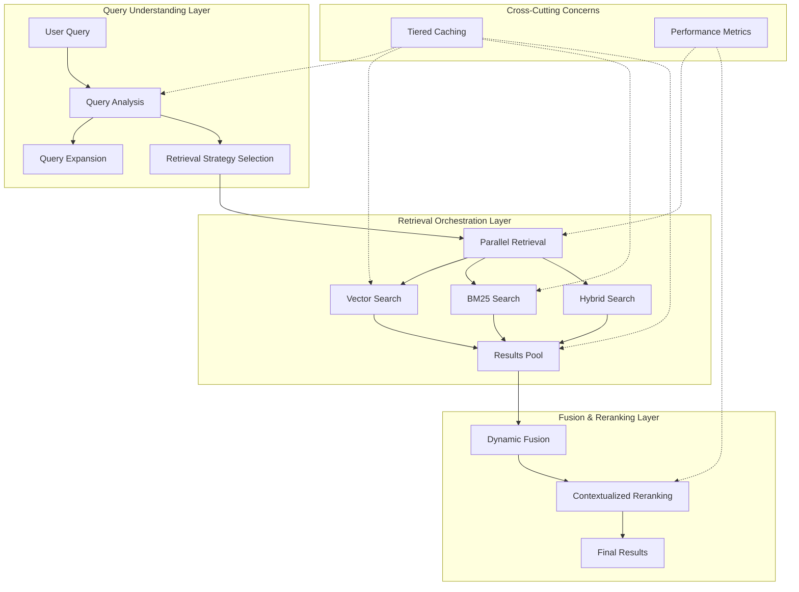
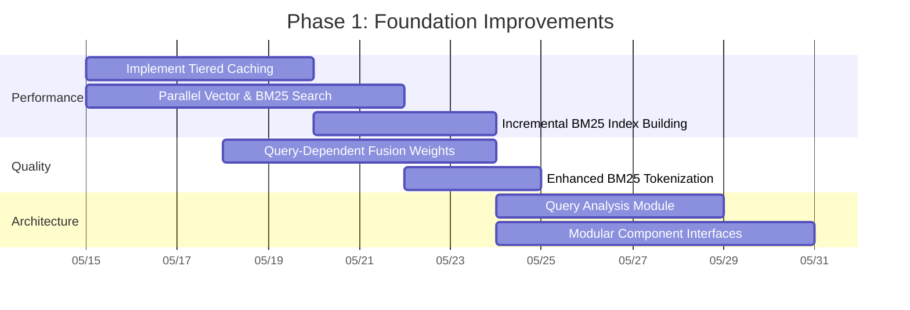
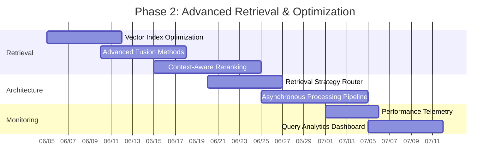
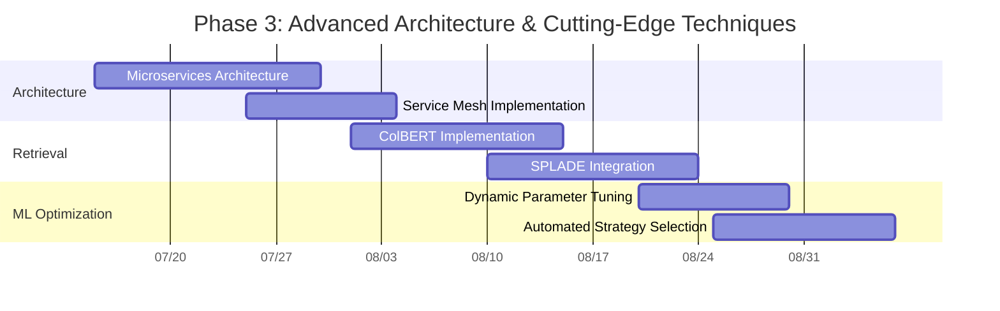

# RAG Retrieval Pipeline Comprehensive Improvement Plan

## Executive Summary

This document presents a comprehensive improvement plan for the RAG retrieval pipeline, based on thorough analyses of the current implementation in `query_rag.py`. The plan addresses identified bottlenecks and inefficiencies through a phased, prioritized approach, balancing quick wins with longer-term architectural improvements.

Key focus areas include:
1. **Architecture Transformation**: Moving from a monolithic design to a modular, layered system
2. **Performance Optimization**: Addressing bottlenecks through parallelization, caching, and incremental processing
3. **Relevance Enhancement**: Improving search quality through advanced retrieval, fusion, and reranking methods
4. **Scalability Improvements**: Enabling the system to efficiently handle increasing data volumes and query loads

The implementation roadmap outlines three phases, starting with high-impact, lower-complexity improvements, and progressing to more advanced architectural changes.

## Current System Analysis

### Architecture Issues

The current implementation suffers from several architectural limitations:

1. **Monolithic Design**:
   - Tightly coupled components with high interdependency
   - Limited separation of concerns
   - Difficult to extend, maintain, or optimize individual components

2. **Sequential Processing**:
   - Linear execution flow with minimal parallelization
   - Vector search followed by BM25 reranking in sequence
   - Limited use of asynchronous operations

3. **Rigid Query Flow**:
   - Fixed retrieval strategy regardless of query characteristics
   - Limited ability to optimize for different query types
   - One-size-fits-all approach to fusion and reranking

### Performance Bottlenecks

1. **Sequential Vector-First Approach**:
   - BM25 processing waits for vector search completion
   - Underutilization of available compute resources
   - Increased latency for complex queries

2. **Inefficient BM25 Index Building**:
   - Full collection scan on every execution
   - No incremental updates for new documents
   - Redundant processing of unchanged documents

3. **Limited Caching**:
   - No query-level cache for frequent queries
   - Embedding generation repeated for similar queries
   - Results not preserved between runs

4. **Synchronous Operations**:
   - Blocking I/O operations throughout the pipeline
   - Sequential execution of independent operations
   - Limited use of modern async patterns

### Search Quality Limitations

1. **Static Fusion Parameters**:
   - Fixed alpha=0.5 for all queries
   - No adaptation to query characteristics
   - Suboptimal weighting for different query types

2. **Basic Tokenization**:
   - Simple split() for BM25 tokenization
   - No stopword removal or normalization
   - Limited handling of special characters and edge cases

3. **Limited Relevance Tuning**:
   - Fixed parameters for reranking
   - No query-dependent parameter selection
   - Limited ability to balance precision and recall dynamically

## Proposed Architecture Vision

The proposed architecture transforms the current monolithic design into a layered, modular system with clear separation of concerns and optimized flow:



### Architecture Components

1. **Query Understanding Layer**:
   - Analyzes query characteristics to determine optimal retrieval strategies
   - Performs query expansion when beneficial
   - Identifies key entities and concepts for boosting

2. **Retrieval Orchestration Layer**:
   - Coordinates parallel retrieval operations across different methods
   - Implements strategy-specific optimizations
   - Manages asynchronous execution for improved latency

3. **Fusion & Reranking Layer**:
   - Dynamically selects fusion method based on query characteristics
   - Applies advanced reranking algorithms with contextual understanding
   - Optimizes result ordering based on diversity and relevance

4. **Cross-Cutting Concerns**:
   - Tiered caching across multiple levels (query, embedding, results)
   - Performance monitoring and telemetry
   - Dynamic parameter optimization based on feedback

## Phased Implementation Plan

The implementation is organized into three phases, prioritizing high-impact, lower-complexity improvements first:

### Phase 1: Foundation Improvements (High Impact, Lower Complexity)



#### Key Implementations:

1. **Tiered Caching Strategy**:
   ```python
   # Add query-level caching
   class ResultsCache:
       """Simple cache with TTL for search results."""
       def __init__(self, ttl=300):  # 5 minutes TTL by default
           self.cache = {}
           self.ttl = ttl
       
       def get(self, key):
           if key in self.cache:
               result, timestamp = self.cache[key]
               if time.time() - timestamp < self.ttl:
                   return result
               else:
                   # Expired
                   del self.cache[key]
           return None
       
       def set(self, key, value):
           self.cache[key] = (value, time.time())
   
   # Add embedding-level caching
   @lru_cache(maxsize=50)  # Cache up to 50 query embeddings
   def get_cached_embedding(text, model_name):
       """Get cached embedding or create a new one"""
       click.echo(f"[info] Generating embedding for query")
       # Embedding generation logic...
       return embedding
   ```

2. **Parallel Retrieval Implementation**:
   ```python
   async def parallel_retrieval(query_text, vector, collection, k, filter_obj, client):
       """Run vector and BM25 searches in parallel"""
       
       # Run both searches concurrently
       vector_results, bm25_results = await asyncio.gather(
           vector_search(vector, collection, k, filter_obj, client),
           bm25_search(query_text, collection, k, filter_obj)
       )
       
       return vector_results, bm25_results
   ```

3. **Query-Dependent Fusion Weights**:
   ```python
   def analyze_query(query_text, default_alpha=0.5):
       """Analyze query to determine best fusion weights"""
       # Simple rules-based approach
       query_lower = query_text.lower()
       
       # Check for factual indicators (who, what, when, where)
       factual_indicators = ['who', 'what', 'when', 'where', 'which', 'how many']
       factual_score = sum(1 for word in factual_indicators if word in query_lower.split())
       
       # Check for conceptual indicators (why, how, explain, describe)
       conceptual_indicators = ['why', 'how', 'explain', 'describe', 'compare']
       conceptual_score = sum(1 for word in conceptual_indicators if word in query_lower.split())
       
       # Determine alpha value (vector vs BM25)
       if factual_score > conceptual_score:
           return max(0.3, default_alpha - 0.2)  # More weight to BM25
       elif conceptual_score > factual_score:
           return min(0.7, default_alpha + 0.2)  # More weight to vectors
       else:
           return default_alpha  # Balanced
   ```

4. **Incremental BM25 Index Building**:
   ```python
   def build_incremental_bm25_index(collection, index_path, client):
       """Build BM25 index incrementally, avoiding full collection scan"""
       existing_index = {}
       if os.path.exists(index_path):
           with open(index_path, "r") as f:
               existing_index = json.load(f)
       
       # Get collection info to find latest point ID
       collection_info = client.get_collection(collection_name=collection)
       total_vectors = collection_info.vectors_count
       
       # Skip if existing index covers all points
       if len(existing_index) >= total_vectors:
           return existing_index
       
       # Process new entries only in batches
       offset = None
       while True:
           records, offset = client.scroll(
               collection_name=collection,
               limit=1000,
               offset=offset,
               with_payload=True,
           )
           
           if not records:
               break
           
           for rec in records:
               # Skip if already in index
               if rec.id in existing_index:
                   continue
                   
               payload = getattr(rec, 'payload', {}) or {}
               text = payload.get("chunk_text")
               if isinstance(text, str) and text:
                   existing_index[rec.id] = text
           
           if offset is None:
               break
       
       # Save updated index
       with open(index_path, "w") as f:
           json.dump(existing_index, f)
       
       return existing_index
   ```

5. **Enhanced BM25 Tokenization**:
   ```python
   def improved_tokenize(text):
       """Better tokenization for BM25"""
       # Clean text
       text = re.sub(r'[^\w\s-]', ' ', text)
       text = re.sub(r'\s+', ' ', text).strip().lower()
       
       # Split by whitespace
       tokens = text.split()
       
       # Remove stopwords (can be expanded)
       stopwords = {'and', 'the', 'is', 'in', 'to', 'of', 'a'}
       tokens = [t for t in tokens if t not in stopwords]
       
       return tokens
   ```

### Phase 2: Advanced Retrieval & Optimization (Medium Impact, Medium Complexity)



#### Key Implementations:

1. **Vector Index Optimization**:
   - Configure optimal HNSW parameters for better speed/recall balance
   - Implement vector quantization for memory efficiency
   - Experiment with dimensionality reduction techniques

2. **Advanced Fusion Methods**:
   ```python
   def normalized_fusion(vec_scores, bm25_scores, alpha=0.5, method="softmax"):
       """Fuse scores with proper normalization and multiple methods"""
       # Normalize each score distribution
       vec_min, vec_max = min(vec_scores.values()), max(vec_scores.values())
       vec_range = vec_max - vec_min
       normalized_vec = {
           pid: (score - vec_min) / vec_range if vec_range > 0 else 0.5
           for pid, score in vec_scores.items()
       }
           
       bm25_min, bm25_max = min(bm25_scores.values()), max(bm25_scores.values())
       bm25_range = bm25_max - bm25_min
       normalized_bm25 = {
           pid: (score - bm25_min) / bm25_range if bm25_range > 0 else 0.5
           for pid, score in bm25_scores.items()
       }
       
       # Apply chosen fusion method
       if method == "softmax":
           # Temperature-controlled softmax fusion
           return softmax_fusion(normalized_vec, normalized_bm25, alpha)
       elif method == "rrf":
           # Reciprocal Rank Fusion
           return rrf_fusion(normalized_vec, normalized_bm25, alpha)
       else:
           # Default: linear combination
           return {
               pid: alpha * normalized_vec.get(pid, 0) + (1-alpha) * normalized_bm25.get(pid, 0)
               for pid in set(normalized_vec) | set(normalized_bm25)
           }
   ```

3. **Retrieval Strategy Router**:
   ```python
   def route_query(query_text, query_embedding):
       """Determine best retrieval path based on query analysis"""
       query_analysis = analyze_query(query_text)
       
       if query_analysis["query_type"] == "factual":
           return {
               "primary_retriever": "bm25",
               "secondary_retriever": "vector",
               "fusion_weight": 0.3,  # Vector weight
               "fusion_method": "rrf",
               "rerank_threshold": 0.6
           }
       elif query_analysis["query_type"] == "conceptual":
           return {
               "primary_retriever": "vector",
               "secondary_retriever": "bm25",
               "fusion_weight": 0.7,  # Vector weight
               "fusion_method": "softmax",
               "rerank_threshold": 0.4
           }
       else:  # "mixed" or default
           return {
               "primary_retriever": "hybrid",
               "secondary_retriever": None,
               "fusion_weight": 0.5,  # Balanced
               "fusion_method": "linear",
               "rerank_threshold": 0.5
           }
   ```

4. **Asynchronous Processing Pipeline**:
   ```python
   async def process_query(query_text, collection, client, openai_client, k=20):
       """Process query through the entire pipeline asynchronously"""
       # Get cached results if available
       cache_key = f"{query_text}:{collection}:{k}"
       cached_result = results_cache.get(cache_key)
       if cached_result:
           return cached_result
       
       # Query analysis and embedding generation
       query_analysis, query_embedding = await asyncio.gather(
           analyze_query_async(query_text),
           get_cached_embedding_async(query_text, model_name, openai_client)
       )
       
       # Determine retrieval strategy
       strategy = route_query(query_text, query_embedding, query_analysis)
       
       # Execute retrievers in parallel
       retrieval_results = await execute_retrieval_strategy(
           strategy, query_text, query_embedding, collection, k, client
       )
       
       # Apply fusion method based on strategy
       fused_results = await apply_fusion(
           strategy, retrieval_results, query_analysis
       )
       
       # Apply reranking if needed
       final_results = await apply_reranking(
           fused_results, query_text, query_embedding, strategy
       )
       
       # Cache results
       results_cache.set(cache_key, final_results)
       
       return final_results
   ```

### Phase 3: Advanced Architecture & Cutting-Edge Techniques (High Impact, High Complexity)



#### Key Implementations:

1. **Microservices Architecture**:
   - Query Service: Handles query analysis and orchestration
   - Vector Search Service: Manages vector embedding and retrieval
   - BM25 Service: Manages lexical search
   - Fusion Service: Handles result combination and reranking
   - Cache Service: Provides distributed caching

2. **ColBERT Implementation**:
   ```python
   class ColBERT:
       """ColBERT implementation for token-level interaction"""
       
       def __init__(self, model_name="text-embedding-3-small"):
           self.model_name = model_name
           
       async def embed_query(self, query, openai_client):
           """Create token-level embeddings for query"""
           # Tokenize query into meaningful units
           tokens = self._tokenize(query)
           
           # Embed each token
           token_embeddings = []
           for token in tokens:
               embedding = await self._get_embedding(token, openai_client)
               token_embeddings.append(embedding)
               
           return token_embeddings
               
       def score(self, token_embeddings, document_vector):
           """Late interaction scoring between query tokens and document"""
           scores = []
           for token_vector in token_embeddings:
               sim = self._calculate_similarity(token_vector, document_vector)
               scores.append(sim)
               
           # Take max similarity for each query token
           return sum(scores) / len(scores)
   ```

3. **Dynamic Parameter Tuning**:
   ```python
   class DynamicParameterTuner:
       """Tune retrieval parameters based on feedback and performance"""
       
       def __init__(self, collection, client):
           self.collection = collection
           self.client = client
           self.parameter_history = {}
           self.feedback_data = []
           
       async def optimize_parameters(self, query_type):
           """Get optimized parameters based on historical performance"""
           if query_type in self.parameter_history:
               return self.parameter_history[query_type]
               
           # Get default parameters for this query type
           params = self._get_default_parameters(query_type)
           
           # Optimize based on feedback data
           if self.feedback_data:
               params = self._tune_parameters(params, query_type)
               
           return params
           
       def record_feedback(self, query, strategy, results, user_feedback):
           """Record retrieval performance to improve future parameters"""
           self.feedback_data.append({
               "query": query,
               "strategy": strategy,
               "results": results,
               "feedback": user_feedback,
               "timestamp": datetime.now().isoformat()
           })
           
           # Re-tune parameters based on new feedback
           self._update_parameter_models()
   ```

## Impact/Complexity Matrix

| Improvement | Impact | Complexity | Priority |
|-------------|--------|------------|----------|
| Tiered Caching | High | Low | P0 |
| Parallel Retrieval | High | Medium | P0 |
| Query-Dependent Fusion | High | Low | P0 |
| Incremental BM25 Index | Medium | Low | P1 |
| Enhanced BM25 Tokenization | Medium | Low | P1 |
| Advanced Fusion Methods | Medium | Medium | P2 |
| Retrieval Strategy Router | High | Medium | P1 |
| Vector Index Optimization | Medium | Medium | P2 |
| Context-Aware Reranking | High | Medium | P1 |
| Asynchronous Pipeline | High | High | P2 |
| Performance Telemetry | Medium | Low | P2 |
| Microservices Architecture | High | Very High | P3 |
| ColBERT Implementation | High | High | P3 |
| SPLADE Integration | Medium | High | P3 |
| Dynamic Parameter Tuning | Medium | High | P3 |

## Key Architectural Changes

1. **Modular Component Design**: Replace the monolithic structure with well-defined interfaces between components

2. **Advanced Query Router**: Dynamically select optimal retrieval strategy based on query analysis

3. **Parallel Execution Framework**: Execute multiple retrievers concurrently for improved latency

4. **Tiered Caching**: Implement multi-level caching (query, embedding, and result caches)

5. **Adaptive Fusion**: Choose fusion method dynamically based on query characteristics

## Implementation Strategy

1. **Start with Quick Wins**: Begin with high-impact, low-complexity improvements in Phase 1
   - Caching, parallel retrieval, query-dependent fusion

2. **Refactor Core Architecture**: Incrementally introduce modularity and better interfaces
   - Query analysis, strategy routing, advanced fusion

3. **Implement Advanced Retrieval**: Add sophisticated techniques once foundation is solid
   - ColBERT, SPLADE, dynamic parameter tuning

4. **Continuous Evaluation**: Establish metrics for measuring improvements
   - Search latency, result relevance, memory utilization

## Conclusion

This comprehensive plan provides a clear roadmap for transforming the current RAG retrieval pipeline into a more efficient, relevant, and scalable system. By implementing these improvements in a phased approach, we can achieve immediate benefits while building toward a more sophisticated architecture.

The plan balances theoretical advances with practical implementation considerations, ensuring that each phase delivers tangible improvements while setting the stage for more advanced capabilities. This approach minimizes disruption while maximizing the impact of each improvement.